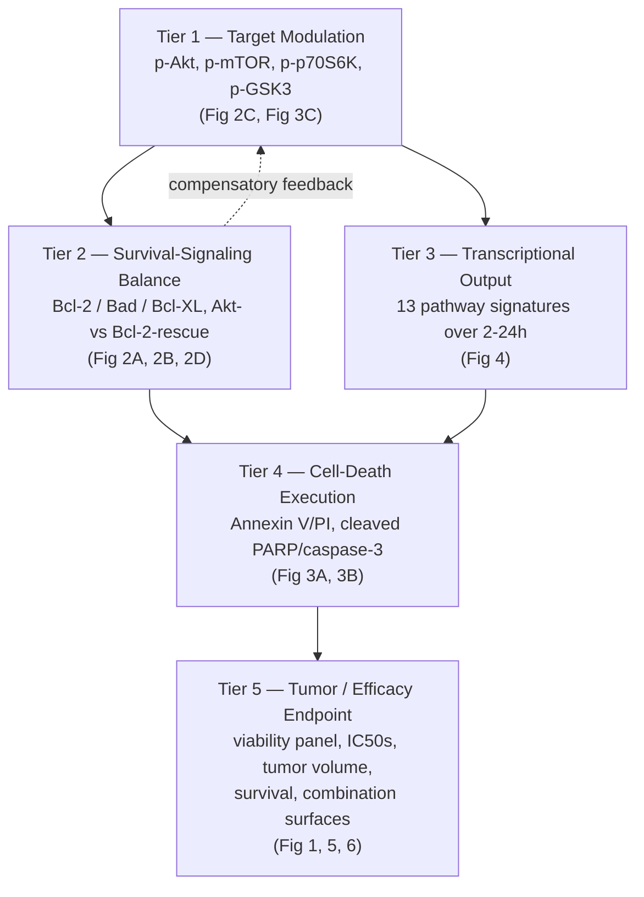

# QSP PD Biomarker Cascade — NVP-BEZ235 in Multiple Myeloma

**Source paper:** McMillin DW, Ooi M, Delmore J, et al. "Antimyeloma Activity of the Orally Bioavailable Dual Phosphatidylinositol 3-Kinase/Mammalian Target of Rapamycin Inhibitor NVP-BEZ235." *Cancer Research* 2009;69(14):5835–42.

**Companion file:** `BEZ235_QSP_PD_Biomarker_Cascade_Annotations.xlsx` — one row per figure/panel with cascade tier, MOA node, assay method, dose/time coverage, data extractability, and a suggested PD model form. This document explains the cascade logic behind that spreadsheet and flags what a modeller needs to know before fitting anything.

---

## 1. Does the proposed flow hold up?

Categorizing by mechanism of action, then checking whether a signaling cascade exists and is quantifiable, then looking at tumor biomarker suppression is the right shape — it's the standard proximal → distal → efficacy structure used in PK/PD and QSP biomarker modeling. The one refinement worth making for this specific paper is splitting it into five tiers instead of three, because BEZ235's biology has two distinct hand-off points that would otherwise get collapsed together: a **survival-signaling buffer** (Bcl-2 can partially rescue cells even when the drug hits its targets) sits between target modulation and cell death, and a **transcriptional integration step** sits between target modulation and phenotype. Both are directly measured in this paper and both matter for a mechanistic model.



---

## 2. The five tiers

### Tier 1 — Target Modulation
The most proximal readout: direct evidence that BEZ235 is hitting PI3K and mTOR. Phospho-Akt (Ser473, Thr308) drops within 2–8h of 100 nM exposure (Fig 2C); phospho-mTOR and phospho-p70S6K drop on a similar timescale, while phospho-GSK3 shows an initial decrease followed by a late rebound at 16–24h (Fig 3C). That rebound is worth keeping as an explicit feature — it's node-specific compensatory reactivation, not noise.

*Modeling caveat:* all of this kinetic data comes from a single dose (100 nM). It supports fitting a turnover/delay model at that dose, but not a dose-response relationship at the target-modulation level itself — that only exists further downstream, in the viability curves.

### Tier 2 — Survival-Signaling Balance
This is the tier that explains why target modulation doesn't always translate cleanly into cell death. Two genetic-rescue experiments pin it down precisely: overexpressing constitutively active Akt does **not** protect MM.1S cells (Fig 2A — the myrAkt curve tracks parental almost exactly, even slightly more sensitive), but overexpressing Bcl-2 does provide partial protection, producing a survival curve with a non-zero plateau around 30% at high doses instead of dropping to zero (Fig 2B). Fig 2D's western blot shows the mechanism: BEZ235 exposure triggers a compensatory rise in Bcl-2 in parental cells, while Bad and Bcl-XL stay flat.

This tier is the most directly useful one for the dual-target threshold structure already in use elsewhere in the pipeline (see Section 4).

### Tier 3 — Transcriptional / Pathway Output
Fig 4 is the richest quantitative time-course dataset in the paper: 13 GSEA-style pathway signatures (two myc signatures, high-risk MM, angiogenic, proteasome, undifferentiated human ES cell, mouse embryonic stem cell, p53-downregulated, hedgehog, hTERT, IRF4, notch, ribosome) measured at 2, 4, 8, 16, and 24h, each with a 95% CI on the average signal difference versus control. Myc and proteasome signatures show the earliest and largest decreases, consistent with rapid transcriptional shutdown following pathway inhibition.

*Modeling caveat:* the values shown are read off a bar chart. Before digitizing, it's worth checking whether the underlying HT-U133A/U133B microarray data were deposited in a public repository (GEO accession isn't stated in the visible text or reference list) — pulling exact values from a deposited dataset would be far more reliable than pixel-measuring bars.

### Tier 4 — Cell-Death Execution
Annexin V/PI flow cytometry (Fig 3A) gives clean, quantitative time-resolved percentages for early (Annexin+/PI–) and late (Annexin+/PI+) apoptotic populations at 0, 24, 36, and 48h, with a clear inflection between 24 and 36h. This lines up with PARP and caspase-3 cleavage on western blot (Fig 3B), which shows cleaved bands appearing/intensifying from roughly 8–16h onward — though that blot, like the others, is qualitative (no densitometry reported).

The text also mentions a separate commitment-to-death experiment (MM.1S needs less than 24h of exposure to commit to death; the more resistant line MR20 needs more than 24h) but that data lives in Supplementary Fig S2, which isn't in the uploaded PDF.

### Tier 5 — Tumor / Efficacy Endpoint
This tier is where mechanism becomes outcome, and it's the strongest part of the dataset overall:

- **Fig 1A** gives printed numeric IC50 values for a 20-line MM cell panel, spanning roughly 22 nM to >800 nM — ideal for seeding a virtual population or sensitivity-stratification layer.
- **Fig 1B–D** add primary patient samples and selectivity comparators (bone marrow stromal cells, hepatocytes, PBMCs), all barely affected up to 800 nM — the therapeutic-index evidence.
- **Fig 5A/B** are a clean two-arm in vivo xenograft dataset: tumor volume over time and Kaplan-Meier survival, both statistically significant, but with no in vivo dose-ranging and no PK sampling in this study.
- **Fig 6A–C** are 3D response-surface plots for BEZ235 combined with bortezomib, doxorubicin, and dexamethasone, showing additive (not synergistic or antagonistic) effects — useful as a validation target for a combination model, though exact z-values are harder to extract from a 3D mesh than from a 2D curve.

---

## 3. Digitized curve and endpoint data

The first version of this deliverable annotated figures without extracting actual numbers from the curves — that gap has now been closed for the highest-value, most tractable panels. Method: each page was rendered from the source PDF at 400 DPI, axis tick positions were located by pixel analysis, and data-marker centroids were extracted with OpenCV connected-component detection, then cross-checked visually against the enlarged image. These are best-effort reconstructions, not author-supplied values, except where the paper prints numbers directly (Fig 1A, Fig 3A) — treat the rest as accurate to roughly ±2–3 percentage points, tighter at high doses than at the lowest, most crowded doses. Full tables are in the **Digitized Data** sheet of the companion workbook; key ones are reproduced here.

### Fig 1A — cell-line IC50 panel (printed values, no digitization needed)

| Cell line | IC50 (nmol/L) | Cell line | IC50 (nmol/L) |
|---|---|---|---|
| MM.1S | 22.16 | SSB45 | 100.88 |
| JJN3 | 17.67 | KMS-5 | 515.04 |
| MM.1R | 24.64 | KMS-12-BM | 425.41 |
| ARK | 27.64 | OCI-MY5 | 623.30 |
| Dox40 | 19.78 | KMS-28-PE | >800 |
| KMS-12-PE | 40.05 | XG1 | >800 |
| NCI-H929 | 31.11 | KMS-28-BM | >800 |
| OPM-6 | 112.96 | MR20 | >800 |
| KMS-11 | 54.71 | | |
| Delta 47 | 141.52 | | |
| OPM-2 | 99.63 | | |
| U266 | 152.64 | | |
| KMS-34 | 347.70 | | |

### Fig 2A — Akt-node rescue (% survival vs BEZ235, pixel-digitized)

| BEZ235 (nM) | MM.1S parental | MM.1S-myrAkt |
|---|---|---|
| 0 | 100 | 100 |
| ~10 | 96 | 97 |
| 25 | 73.5 | 80.9 |
| 50 | 52.4 | 63.0 |
| 100 | 35.2 | 42.9 |
| 200 | 22.7 | 31.5 |
| 400 | 6.7 | 19.1 |
| 800 | 2.4 | 5.6 |

The myrAkt curve sits at or slightly above parental at every single dose — direct numeric confirmation that Akt overexpression provides no protection.

### Fig 2B — Bcl-2-node rescue (% survival vs BEZ235, pixel-digitized)

| BEZ235 (nM) | MM.1S parental | MM.1S-Bcl-2 |
|---|---|---|
| 0 | 100 | 100 |
| ~10 | 65 | 70 |
| 25 | 35.0 | ~66 |
| 50 | 26.0 | 53.7 |
| 100 | 20.1 | 37.9 |
| 200 | 11.2 | 38.2 |
| 400 | 5.2 | 34.3 |
| 800 | 3.7 | 31.7 |

This is the quantitative signature of the "protected fraction": MM.1S-Bcl-2 plateaus at 32–38% survival from 50 nM onward rather than continuing toward zero — a non-zero lower asymptote, not just a rightward IC50 shift. That's the shape a threshold/rescue term in a PD model needs to reproduce.

### Fig 1C — selectivity curves (% survival vs BEZ235, pixel-digitized + visual cross-check)

| BEZ235 (nM) | THLE-3 | HS-5 | MM.1S |
|---|---|---|---|
| 0 | 100 | 100 | 100 |
| ~10 | 92 | 80 | 90 |
| 25 | 92 | 71.1 | 35 |
| 50 | 91.9 | 66.2 | 25 |
| 100 | 86.0 | 63.4 | 20 |
| 200 | 76.4 | 55.8 | 11 |
| 400 | 77.6 | 48.1 | 5 |
| 800 | 76 | 48.7 | 3 |

Note the MM.1S curve here implies an IC50 closer to 25–50 nM by simple interpolation, slightly right of the 22.78 nM nonlinear-regression value in Fig 1A — plausible inter-experiment variability (different day/passage), not a transcription error; flag it as a modeling assumption either way.

### Fig 3A — Annexin V/PI flow cytometry (printed quadrant %, no digitization needed)

| Time (h) | Live | Early apoptotic | Late apoptotic | Necrotic/debris |
|---|---|---|---|---|
| 0 | 98.4 | 0.18 | 0.45 | 0.99 |
| 24 | 91.9 | 3.54 | 2.92 | 1.58 |
| 36 | 70.7 | 14.1 | 12.2 | 2.91 |
| 48 | 52.1 | 9.93 | 37.8 | 0.24 |

### Fig 5A — in vivo tumor volume (mean, visual read)

| Day | Control (mm³) | 30 mg/kg (mm³) |
|---|---|---|
| 28 | 35 | 17 |
| 34 | 75 | 38 |
| 40 | 158 | 42 |
| 47 | 166 | 42 |

### Fig 5B — Kaplan-Meier overall survival (step positions, visual read)

| Day | 30 mg/kg (%) | Control (%) |
|---|---|---|
| 0 | 100 | 100 |
| 25 | 100 | 89 |
| 40 | 80 | 68 |
| 44 | 80 | 56 |
| 48 | 80 | 44 |
| 53 | 80 | 33 |
| 58 | 80 | 22 |
| 60 | 70 | 11 |
| 73 | 70 | 11 |

Step sizes (~11%) are consistent with n≈9 mice/arm; median control survival of 23 days matches the text.

### What's still not digitized, and why

- **Fig 1B** (5 unlabeled MM patient sample curves) and **Fig 1D** (10 overlapping PBMC ± PHA curves) — too much marker overlap for reliable automated separation without assigning false identity to points; can be done manually on request.
- **Fig 4** (13 pathway signatures × 5 time points × 95% CI, ~65 bars total) — technically extractable via color-based bar-tip detection, but genuinely labor-intensive and error-prone as a bar chart with overlapping CI whiskers. Worth checking for a GEO accession behind the microarray data before digitizing this one by hand.
- **Fig 6A–C** (3D response-surface meshes) — reading precise z-values off a 3D wireframe projection is unreliable without the underlying grid data; better to request source data from the authors than to digitize the rendered mesh.

---

## 4. Connection to existing pipeline work

The TakaHuman pipeline already has a validated dual-target threshold PD equation for dactolisib/BEZ235 (`eq:pd_dual_target_threshold_effect`), structured as a product of thresholded effects on each target:

```
Effect = max(E_PI3K − threshold_PI3K, 0)^power_a × max(E_mTOR − threshold_mTOR, 0)^power_b
```

This paper is a strong data source for calibrating and validating that structure:

- **Fig 2A/2B** are direct evidence for where each threshold sits mechanistically — perturbing the Akt node alone doesn't move the curve, but perturbing the Bcl-2 node produces a partial-protection plateau, which is exactly the kind of asymmetric threshold behavior the equation is built to capture.
- **Fig 6A–C** combination surfaces are a ready-made validation set: the paper's own conclusion (additive, not synergistic) is a testable prediction for whatever the calibrated model outputs when the "second agent" term is added.

---

## 5. What's missing / recommended before handoff

1. **Supplementary Figs S1–S7 aren't in the uploaded PDF** but are cited repeatedly for quantitative support — particularly S2 (commitment-to-death kinetics) and S4 (cell-cycle/sub-G1 distribution), which would directly strengthen the Tier 4 model. Worth requesting the supplementary data file from the journal.
2. **All western blots are single representative images with no densitometry.** If the modeller needs continuous values at Tiers 1, 2, or 4 rather than onset-timing/qualitative gates, plan for image densitometry as a discrete task.
3. **Check for a GEO (or similar) accession** behind the Fig 4 microarray data before digitizing the bar chart — exact values would be more reliable than reading a plot.
4. **No BEZ235 PK data exists in this paper.** An exposure-response bridge for the in vivo tumor-growth and survival data (Fig 5) will need PK parameters from elsewhere in the pipeline or the literature.

---

*Companion spreadsheet: `BEZ235_QSP_PD_Biomarker_Cascade_Annotations.xlsx` (sheets: Cascade Map, Figure Annotations, Modeling Notes).*
