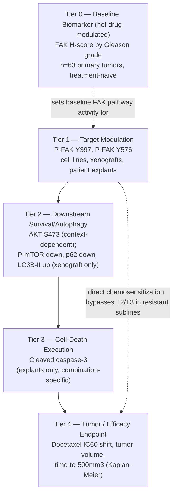

# QSP PD Biomarker Cascade — Defactinib (VS-6063, FAK Inhibitor) + Docetaxel in Prostate Cancer

**Source paper:** Lin H-M, Lee BY, Castillo L, et al. "Effect of FAK inhibitor VS-6063 (defactinib) on docetaxel efficacy in prostate cancer." *The Prostate* 2018;1-10. https://doi.org/10.1002/pros.23476

**Companion file:** `Defactinib_QSP_PD_Biomarker_Cascade_Annotations.xlsx` — Cascade Map, Digitized Data (140 rows of pixel- and visually-digitized numbers), Figure Annotations (20 rows across all 6 main figures), and Modeling Notes.

A note on scope: this paper is the most directly relevant of the three drug workups so far to an existing equation in your pipeline. It studies defactinib itself (not a related tool compound), in the exact target/chemo pairing (FAK/pFAK -> docetaxel resensitization) that `eq:pd_target_suppression_chemo_sensitization_tte` was built to describe, in the exact clinical setting (castration-resistant and -sensitive prostate cancer) that equation targets. Digitization in this pass goes deeper than the BEZ235 or dinaciclib workups — every dose-response curve, bar chart, Kaplan-Meier curve, and scatter plot in the six main figures has been extracted numerically, not just annotated.

---

## 1. The cascade, in five tiers

---

## 2. Tier notes

### Tier 0 — Baseline biomarker: FAK expression vs. disease grade
In 63 treatment-naive primary prostate cancer patients, FAK H-score (IHC, %positive x intensity) is higher in Gleason 6, 7, and 9 tumors than Gleason 5 (p=0.05, 0.03, 0.02) but not significantly different for Gleason 8 (p=0.20, likely underpowered — only ~4 patients in that group). This is a disease-stage covariate establishing clinical relevance of the target, structurally analogous to the cyclin E1 tier in the dinaciclib cascade: it is not modulated by the drug and should not be treated as a response endpoint, but it is a reasonable prior/stratification variable for how much FAK pathway activity a given tumor starts with.

### Tier 1 — Target modulation: the best-instrumented tier in this paper
FAK autophosphorylation (Y397, the FERM-domain site that creates the SH2-docking site for PI3K/Src) and kinase-domain phosphorylation (Y576) are quantified by bar-chart densitometry across five model systems: PC3/PC3-Rx cells (Fig 2B-C), DU145/DU145-Rx cells (Fig 3B-C), PC3 xenografts (Fig 5B-C), and patient-derived explants (Fig 6F, Y576 only — Y397 could not be reliably detected in explant lysates). A consistent pattern holds everywhere: docetaxel alone produces a partial, statistically meaningful reduction in P-FAK; VS-6063 alone produces a larger reduction; the combination produces the deepest suppression of all, in every single model tested. This is worth building into the model explicitly — **docetaxel is not a “clean” cytotoxic partner with zero on-target pathway effect**; it measurably suppresses P-FAK by itself, and the combination's target engagement should be modeled with an interaction term rather than assuming VS-6063 acts alone on this node.

One line-pair-specific nuance: in PC3/PC3-Rx, Y397 and Y576 move together (a single lumped "FAK activation" state would fit both). In DU145/DU145-Rx, VS-6063 alone nearly abolishes Y397 (1.00→0.12) but only partially suppresses Y576 (1.00→0.53) — the two phospho-sites are at least partially separable in this line pair. Also note a normalization difference: the PC3 panels normalize to total FAK (T-FAK), while the DU145 panels normalize to β-actin (because the DU145-Rx batch used had elevated total FAK) — don't directly compare absolute ratios across Fig 2 and Fig 3.

### Tier 2 — Downstream survival signaling / autophagy: model-system-dependent, not universal
AKT(S473) phosphorylation, downstream of FAK via the p85-PI3K docking interaction, tracks cleanly with FAK suppression in PC3/PC3-Rx cells (Fig 2D) and PC3 xenografts (Fig 5D) — but is explicitly **not significant** in patient explants (Fig 6G, p=0.71/0.27/0.22 for DTX/VS6/combination vs. control) and isn't even reported as a quantified panel for DU145/DU145-Rx. The authors offer three possible explanations for the explant discrepancy (greater stromal dilution of signal, differential AKT regulation in cancer cells vs. stroma, greater stroma-cancer crosstalk in the explant architecture) but confirm none. **Treat the FAK→AKT edge as switchable/context-dependent, not a universal downstream consequence of FAK inhibition.**

Separately, in PC3 xenografts only, the combination reduces P-mTOR(S2448) and p62 while increasing LC3B-I→II conversion (1.95→3.40 relative accumulation, Fig 5E) — interpreted as autophagic (type II programmed) cell death, extending the authors' prior work with the first-generation FAK inhibitor PF-00562271. P-mTOR and p62 are blot-image-only (not densitometry-quantified) in this paper, so only the LC3B-II arm of that three-marker signature is numerically fittable from this dataset alone.

### Tier 3 — Cell-death execution: thin, but combination-specific
The only apoptosis readout in the paper is cleaved caspase-3 IHC, measured only in ex vivo patient-derived CSPC explants (11 patients enrolled, 6 evaluable across all four conditions). The result is a clean synergy signature: neither docetaxel alone (p=0.21) nor VS-6063 alone (p=0.88) differs from control, but the combination does (p=0.04, 6.5%→16.0% cancer cells stained). This is strong qualitative evidence for sensitization but a weak basis for a continuous dose-response fit — there is no dose-ranging within this experiment, only four discrete conditions. Use it as a synergy checkpoint for validating a mechanistic model built from the other tiers, not as a curve-fitting target in its own right.

### Tier 4 — Tumor / efficacy endpoint: the paper's central, quantitatively clean dataset
Three levels of efficacy readout converge:

- **In vitro chemosensitization** (Fig 1): docetaxel IC50 shifts 75-fold in PC3-Rx (1167.6→15.6 ng/mL, p<0.0005) and 43-fold in DU145-Rx (2499.6→58.0 ng/mL, p<0.0001) with VS-6063 co-treatment — and is **not significantly shifted** in either parental, docetaxel-sensitive line. This resistance-selectivity is the paper's central mechanistic claim and should be an explicit effect-modifier in any PD model built from this data, not a population-average constant.
- **In vivo tumor growth** (Fig 4A): the combination arm shows a biphasic response — transient regression to ~85% of its peak by day ~19-21, then slow regrowth — which a simple monotonic Emax tumor-growth-inhibition model will not capture without a resistance-emergence or effective-exposure-decay term.
- **Time to progression** (Fig 4B): median time to reach 500 mm³ is 47.5 days for the combination vs. 29.5 days for docetaxel alone (p=0.003, log-rank) — a 1.6-fold extension. Our pixel-digitized Kaplan-Meier step curves independently reproduce these medians (47.3 and 28.2 days at the 50%-crossing points), which is a useful internal validation of the digitization pipeline used throughout this workup.
- **Tolerability** (Fig 4C): the combination arm's mean body weight trough is ~87% of initial (day 14-17); the text separately reports 5/15 mice (33%) had individual weight loss up to 26%, fully recovered after the regimen ended — no mortality or treatment discontinuation attributable to toxicity.

---

## 3. Data-quality flags and digitization confidence — read before fitting anything

**Fig 1 dose-response curves.** The top series in each panel (PC3-Rx+DTX and DU145-Rx+DTX, both filled black circles) is exactly pixel-calibrated: axis-tick detection plus marker-centroid detection recovers a dose ladder of ≈1.6, 7.8, 39, 195, 977, 4883 ng/mL that is internally consistent to within 5% across both independently-digitized panels — strong evidence the calibration is correct. The three other series per panel (VS-6063 combination and the two parental-line curves) overlap substantially above ~40 ng/mL, where the visual separation between markers is only a few pixels; those values are hybrid pixel/visual estimates, good to roughly ±2-3 percentage points, with the widest uncertainty exactly where the curves visually cross.

**Fig 4A tumor-volume curve, black (saline+vehicle) arm.** Automated RGB colour-channel detection for this arm was contaminated by the black DTX/VS6-injection arrow glyphs drawn in the same colour lower in the plot; those specific points were corrected by direct visual reading against the gridlines rather than trusted from the automated pass. The red (combination) and green/blue curves were cleanly separable by colour and are pixel-exact.

**Fig 4B Kaplan-Meier.** The two docetaxel-containing arms (the scientifically important comparison, matching the paper's own emphasis via the # log-rank bracket) were pixel-digitized end to end and cross-validate tightly against the paper's printed medians. The two saline arms' step timings are visual estimates only (their automated detection was likewise contaminated by overlapping black axis/legend elements).

**Fig 6B Gleason-7 scatter (n≈32, the densest cluster in the paper).** Individual points overlap heavily at this density; rather than force 32 unreliable single-point reads, this group is reported as a range + distribution mean, with the plotted mean/SEM error bar read exactly (that read does not depend on resolving individual overlapping points).

**No data was found to contain the kind of outright duplication error we flagged in the dinaciclib paper (Shao et al. Fig 5A)** — the printed numbers in this paper (IC50s, p-values, KM medians) are internally consistent with each other and with our independent pixel digitization wherever the two can be cross-checked.

---

## 4. Direct connection to your existing pipeline equation

This paper is close to a purpose-built validation dataset for **`eq:pd_target_suppression_chemo_sensitization_tte`** (target_suppression → sensitization_fold → IC50_shift → time_to_endpoint_extension, your existing FAK/pFAK→docetaxel resensitization equation for CRPC). All four terms are available from a single, internally consistent experimental system (PC3/PC3-Rx):

| Equation term | Data source | Value |
|---|---|---|
| target_suppression | Fig 2B-C (P-FAK Y397/Y576, PC3-Rx, DTX+VS6 vs. vehicle) | ≈91-92% reduction (1.00-1.10 → 0.09-0.10) |
| sensitization_fold | Fig 1A (printed IC50 ratio, PC3-Rx) | 75-fold (1167.6 / 15.6 ng/mL), p<0.0005 |
| IC50_shift | Fig 1A (printed) | −1152 ng/mL absolute; from 1167.6 to 15.6 ng/mL |
| time_to_endpoint_extension | Fig 4B (printed + pixel-validated Kaplan-Meier median) | 1.6-fold (29.5 → 47.5 days to 500 mm³), p=0.003 |

The DU145/DU145-Rx pair gives a second, independent replicate of the same four-term chain (target suppression ≈88-90% at Y397 in DU145-Rx, sensitization_fold=43x, IC50_shift from 2499.6 to 58.0 ng/mL), though without an in vivo time-to-endpoint arm for that line. Recommend fitting/validating the equation's full chain against the PC3 system first, since it is the only one with all four terms measured in the same paper, then checking whether the fitted relationship (target suppression → sensitization_fold) transfers to the DU145 numbers as an out-of-sample check.

Two structural refinements this paper's data supports:
1. **Resistance-selectivity as an effect modifier.** The 75-fold and 43-fold sensitization values apply only to the docetaxel-resistant sublines; the parental, docetaxel-sensitive lines show no significant IC50 shift at all. If the equation is meant to generalize across a tumor population, sensitization_fold should be gated by (or made a function of) baseline resistance status/baseline P-FAK level — using a single population sensitization_fold constant would misapply the resistant-subline value to sensitive disease.
2. **A biphasic in vivo term.** The Fig 4A combination-arm growth curve (transient regression then regrowth) suggests the time_to_endpoint_extension term may need an underlying tumor-growth-inhibition model with a regrowth/relapse component, rather than treating the whole treatment period as a single constant-hazard interval — the Kaplan-Meier curve is the integrated consequence of that underlying biphasic growth curve, and both are now available (Section on Fig 4A/4B) if a mechanistic (not just descriptive) TTE model is wanted.

---

## 5. What's missing / recommended before handoff

1. **No PK data for VS-6063 or docetaxel** are reported (dose/schedule only) — needed for an actual PK-PD link rather than the current dose-as-proxy approach used throughout this cascade.
2. **P-mTOR(S2448) and p62 densitometry** (Fig 5A) are blot-image-only in this paper — if the autophagy-node mechanism matters for the model, these would need to come from the authors' raw data or a follow-up paper.
3. **Individual patient-level values for Fig 6D/F/G** would remove the residual point-reading uncertainty in the ex vivo scatter panels — worth an author data request, since these are the most clinically proximal (patient-derived) datasets in the paper and directly relevant to translating the mouse/cell-line PD model to the clinic.
4. **No dose-ranging within the explant cleaved-caspase-3 experiment** (Fig 6D) — only four discrete conditions were tested, so this tier cannot support a continuous dose-response fit as-is.
5. **The FAK→AKT coupling's model-system-dependence** (clean in PC3/xenograft, absent in explants) is an open mechanistic question the paper does not resolve; flag this for your modeller friend as a place where the model's structure, not just its parameters, may need to differ by data source.

---

*Companion spreadsheet: `Defactinib_QSP_PD_Biomarker_Cascade_Annotations.xlsx` (sheets: Cascade Map, Digitized Data, Figure Annotations, Modeling Notes).*
