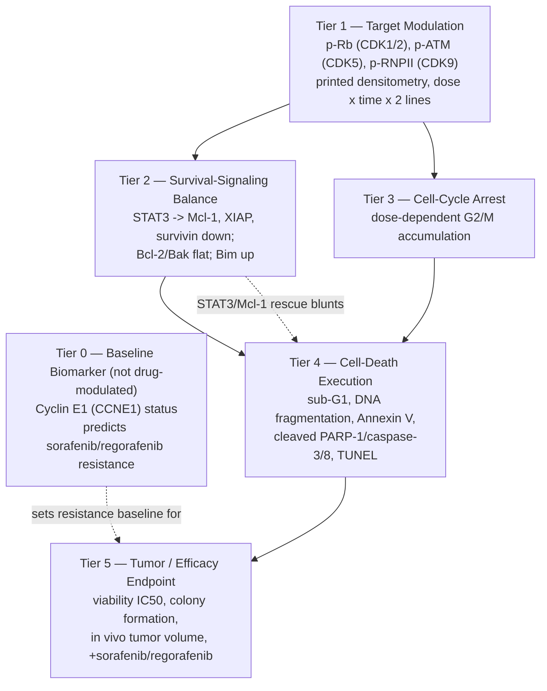

# QSP PD Biomarker Cascade — Dinaciclib (CDK1/2/5/9 Inhibitor) in Hepatocellular Carcinoma

**Source papers:**
1. Xu J, Huang F, Yao Z, et al. "Inhibition of cyclin E1 sensitizes hepatocellular carcinoma cells to regorafenib by mcl-1 suppression." *Cell Communication and Signaling* 2019;17:85.
2. Shao Y-Y, Li Y-S, Hsu H-W, et al. "Potent Activity of Composite Cyclin Dependent Kinase Inhibition against Hepatocellular Carcinoma." *Cancers* 2019;11:1433.

**Companion file:** `Dinaciclib_QSP_PD_Biomarker_Cascade_Annotations.xlsx` — Cascade Map, Digitized Data (printed densitometry + digitized curves), Figure Annotations (38 rows across both papers), and Modeling Notes.

A note on scope: this pair of papers uses dinaciclib mainly as a tool compound alongside flavopiridol, in service of two different arguments — cyclin E1 as a resistance biomarker for sorafenib/regorafenib (Xu et al.), and composite CDK1/2/5/9 inhibition as a standalone mechanism (Shao et al.). The cascade below treats dinaciclib's own pharmacology as the throughline and folds the cyclin E1 story in as a baseline covariate, since that's the role it actually plays in the data.

---

## 1. The cascade, in six tiers

Dinaciclib's biology adds one wrinkle the BEZ235 cascade didn't have: a **baseline predictive biomarker (cyclin E1) that is not itself modulated by the drug**. Cyclin E1 expression predicts how resistant a tumor is to sorafenib/regorafenib, and dinaciclib overcomes that resistance mechanistically — but through the Mcl-1/STAT3 axis, not by changing cyclin E1 itself (Xu et al. confirm this directly). That's Tier 0, sitting outside the drug's own mechanism.



---

## 2. Tier notes

### Tier 0 — Baseline biomarker (cyclin E1), not a response marker
High cyclin E1 (CCNE1) expression correlates with poor HCC survival (HR=1.77, P=0.0012) and predicts weaker response to sorafenib/regorafenib. Genetic overexpression/knockdown experiments (Xu Fig 2) confirm this is causal, not just correlative — but critically, dinaciclib treatment does **not** change cyclin E1 levels (Xu Fig 3E). Model this as a covariate on sorafenib/regorafenib's baseline resistance parameters, separate from dinaciclib's own PD cascade.

### Tier 1 — Target modulation (the best-instrumented tier in either paper)
Shao et al. print exact densitometry ratios for p-Rb (CDK1/2 substrate), p-ATM (CDK5 substrate), and p-RNPII (CDK9 substrate) across a 0–15 nM dose range, at 48h and 72h, in two cell lines (Fig 3A) — a real numeric grid, not something read off a bar chart. Shao Fig 5's siRNA knockdown/overexpression panel goes further and deconvolutes which of the four CDKs actually drives efficacy: individual CDK1 and CDK9 knockdown each significantly reduce colony formation; CDK2 and CDK5 knockdown do not. CDK9 overexpression significantly rescues dinaciclib's efficacy; CDK1 overexpression does not. Net picture: CDK9 is the dominant node, CDK1 contributes but isn't rescuable the same way, CDK2/CDK5 are minor players — this is a strong basis for a multi-target weighted PD structure (Section 4).

One important flag: four of the printed rows in Fig 5A (CDK9, p-Rb, p-ATM, p-RNPII) are numerically identical — see Section 3.

### Tier 2 — Survival-signaling balance (unusually well causally validated)
Dinaciclib suppresses Mcl-1 transcription through STAT3: phospho-STAT3 drops with dinaciclib exposure, STAT3 ChIP shows reduced binding to the Mcl-1 promoter, and a Mcl-1-promoter luciferase reporter drops correspondingly (Xu Fig 5). Cycloheximide-chase experiments show this is transcriptional suppression, not accelerated protein degradation (Fig 5B) — an important structural constraint. Two independent rescue experiments confirm the causal chain: Mcl-1 overexpression blunts dinaciclib+regorafenib-induced apoptosis (Fig 4E-F), and STAT3 overexpression independently does the same (Fig 5F-G). Shao's densitometry (Fig 3B) corroborates this at the protein level across both cell lines: Mcl-1, XIAP and survivin all decline consistently with dose and time, while Bcl-2 and Bak stay comparatively flat.

### Tier 3 — Cell-cycle arrest
Composite CDK inhibition produces dose-dependent G2/M accumulation (Shao Fig 1E-F, quantitative bar charts) and G1/S arrest (Xu Fig 3B, representative histogram only). This sits upstream of the death-execution tier as the proximal phenotypic consequence of hitting four cell-cycle-relevant kinases at once.

### Tier 4 — Cell-death execution (five converging readouts)
Both papers converge on the same conclusion through independent assays: sub-G1 fraction, DNA fragmentation ELISA, Annexin V/PI flow cytometry, cleaved PARP-1 (with real densitometry), and cleaved caspase-3/8. That redundancy is a strength — cross-validate the readouts against each other before picking one as your primary fitting target, since they're not perfectly consistent (see Section 3, TUNEL vs. tumor volume).

### Tier 5 — Tumor / efficacy endpoint
Shao Fig 1A gives printed IC50s for four cell lines (HuH7 8.5 nM, PLC5 11.8 nM, Hep3B 15.6 nM, HLE 9.7 nM) — notably independent of baseline Rb or c-myc expression level, a clean negative-covariate finding. In vivo, dinaciclib monotherapy slows HuH7 and PLC5 xenograft growth in a manner roughly comparable to sorafenib (Shao Fig 4). Xu et al. push further into combination territory: dinaciclib (or flavopiridol) added to regorafenib or sorafenib roughly doubles apoptosis versus either single agent in vitro (Fig 3F-G) and produces the flattest in vivo tumor growth curve of any arm tested (Fig 6A) — this is the paper's central sensitization argument and the most clinically relevant dataset here.

---

## 3. Data-quality flags — read before fitting anything

**Fig 5A duplicated densitometry row (Shao et al.).** The exact six-number row `1.78, 1.89, 1.71, 1.38, 0.65, 1.45` is printed under four different blots — CDK9, p-Rb, p-ATM, and p-RNPII — as if it were each blot's own quantification. We re-read this at 400 DPI three times to rule out a misread on our end; it's the same numbers, character for character, under all four. Biologically these are four unrelated measurements (a CDK's own knockdown efficiency vs. three downstream phospho-targets) and would not plausibly match to two decimal places by chance. This reads as a copy-paste error in the original figure assembly. **Do not use these four rows as independent quantitative inputs.** The colony-formation bar charts in the same figure (Fig 5B-E) are a separate assay and are unaffected — the CDK9-dominance conclusion in Section 4 rests on those, not on the flagged densitometry.

A related, smaller version of the same pattern appears in Fig 3A: the "Rb (total), PLC5" densitometry row is identical to the "p-RNPII (S2), PLC5" row. Worth the same caution.

**Tumor volume and apoptosis disagree on dose-response shape (Shao et al.).** In vivo, 20 mg/kg and 40 mg/kg dinaciclib produce nearly superimposed HuH7 tumor-volume curves (Fig 4B) — an apparent plateau. But TUNEL apoptosis in the same tumors *does* separate the two doses cleanly (~2.3× vs. ~3.9× control, Fig 4D). The tumor-volume endpoint seems to saturate before the underlying cell-killing rate does. Keep both endpoints in a model rather than assuming one predicts the other linearly.

**MTT and colony-formation IC50s rank cell lines differently.** By 72h MTT, HuH7 is the most sensitive line (8.5 nM) and PLC5 less so (11.8 nM). By 10–14 day colony formation, PLC5 is more sensitive at 5 nM (0.62 relative colonies) than HuH7 (0.09). These assays measure different things — acute cytostasis vs. reproductive/clonogenic death — so don't treat their potency values as interchangeable; pick the one that matches what your model needs to predict.

---

## 4. Extending your existing PD-equation framework

Your pipeline already has a validated dual-target threshold structure for dactolisib/BEZ235:

```
Effect = max(E_PI3K − threshold_PI3K, 0)^power_a × max(E_mTOR − threshold_mTOR, 0)^power_b
```

Dinaciclib is a natural candidate to extend this to an **N-target weighted structure**, since it hits four kinases (CDK1, 2, 5, 9) rather than two, and Shao Fig 5 gives you real deconvolution data to fit the weights rather than guessing them:

```
Effect = Σ_i  w_i · max(E_i − threshold_i, 0)^power_i      for i ∈ {CDK1, CDK2, CDK5, CDK9}
```

with the knockdown/overexpression data suggesting `w_CDK9 ≳ w_CDK1 >> w_CDK2 ≈ w_CDK5` — CDK9 knockdown and overexpression both move colony formation significantly in the expected directions, CDK1 knockdown reduces colony formation but CDK1 overexpression doesn't rescue efficacy, and CDK2/CDK5 knockdown alone do nothing. That asymmetry (a target that matters when removed but doesn't rescue when added back) is worth preserving structurally rather than collapsing into a single symmetric weight.

Separately, the Mcl-1/STAT3 rescue data (Section 2, Tier 2) is structurally identical to the Bcl-2 rescue in the BEZ235 paper — a downstream survival-signaling node that partially decouples target modulation from cell death. If your BEZ235 equation already has a place for that kind of term, the same slot should accommodate dinaciclib's STAT3→Mcl-1 axis with minimal restructuring.

---

## 5. What's missing / recommended before handoff

1. **Cross-check the flagged Fig 5A densitometry** against Shao et al.'s supplementary materials (a Figure S1 is cited but not included in this PDF) or contact the authors — needed if precise per-CDK knockdown efficiencies matter for your weight-fitting.
2. **Xu Fig 1D-E and Fig 2C dose-response curves** were reviewed but not pixel-digitized — they sit on a log[M] axis without fine enough gridline detail for confident calibration in this pass. Flag for manual digitization if exact sorafenib/regorafenib curves (rather than the IC50 bar-chart summary) are needed.
3. **Shao Fig 4E-F (PLC5 in vivo, 13 timepoints)** was read visually but not pixel-calibrated — lower priority since Fig 4B already anchors the monotherapy dose-response in a cleaner 3-arm chart.
4. **No human PK/PD or biopsy data in either paper** — same caveat as the BEZ235 cascade: this is a preclinical mechanistic scaffold, not a clinical PD dataset.

---

*Companion spreadsheet: `Dinaciclib_QSP_PD_Biomarker_Cascade_Annotations.xlsx` (sheets: Cascade Map, Digitized Data, Figure Annotations, Modeling Notes).*
